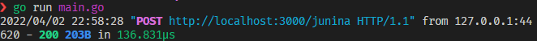

# curso-go
Repositório do curso introdutório da linguagem Go

## Inicializando o módulo

    cd curso-go/
    
## Executando

    go run main.go



## Enviar Requisição HTTP

Ex.:

```
curl -X POST http://localhost:3000/junina \
   -H 'Content-Type: application/json' \
   -d '{"homens":5,"mulheres":6,"criancas":15,"acompanhamentos": true}'
```

Resposta do servidor será 

```
{
  "total-pessoas": 26,
  "total-pares-adultos": 5,
  "pares-homem-mulher": 5,
  "pares-adultos-mesmo-sexo": 0,
  "pares-criancas": 7,
  "total-acompanhamentos": 7800,
  "quentoes-nao-alcoolicos": 10400,
  "quentoes-alcoolicos": 5500
}
```
## Teste

```
go test ./... -cover 
```
## Compilando

```
go build -o bin/curso main.go
GOOS=darwin GOARCH=amd64 go build -o bin/curso main.go
GOOS=darwin GOARCH=arm64 go build -o bin/curso main.go
GOOS=windows GOARCH=amd64 go build -o bin/curso main.go
GOOS=linux GOARCH=amd64 go build -o bin/curso main.go
```